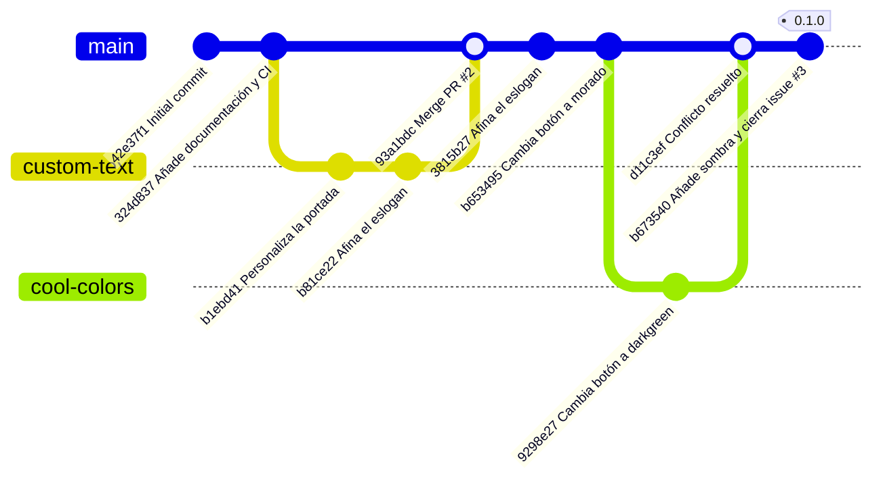

# git-work — flujo colaborativo con Git

Repositorio de práctica del flujo colaborativo (fork, issue, rama, PR,
conflicto, etiqueta y release) del módulo DPL.

## Índice

- [Entorno e instalación](#entorno-e-instalacion)
- [Configuración](#configuracion)
- [Flujo colaborativo](#flujo-colaborativo)
- [Comprobación](#comprobacion)
- [Problemas encontrados y solución](#problemas-encontrados-y-solucion)
- [Repositorio remoto](#repositorio-remoto)

## Entorno e instalacion

La práctica se ha realizado con Git y GitHub, utilizando GitHub CLI (`gh`) para gestionar issues, pull requests y releases desde la terminal.

Se ha trabajado en modalidad individual mediante un repositorio principal (`git-work`) y un repositorio espejo (`git-work-espejo`) que representa el papel de `user2`.


El repositorio principal se encuentra en:

```bash
~/dpl/ae1/
```

El repositorio espejo usado para `user2` se encuentra en:

```bash
~/dpl/ae1-user2/
```
Para comprobar la versión de Git:

```bash
git --version
```

El proyecto web puede visualizarse abriendo `index.html` en un navegador.

La documentación se genera mediante MkDocs utilizando:

```bash
mkdocs build --strict
```

## Configuración

El repositorio contiene una página web para una startup y una hoja de estilos.

Los ficheros modificados durante la práctica fueron:

- `LICENSE`: licencia abierta del proyecto.
- `index.html`: contenido y personalización de la portada de la startup.
- `css/cover.css`: estilos de la portada y del botón principal.
- `mkdocs.yml`: configuración de MkDocs para generar la documentación.
- `docs/index.md`: página principal de la documentación escrita en Markdown.
- `.github/workflows/ci.yml`: integración continua de la documentación.
- `.gitignore`: evita versionar ficheros que no deben formar parte del repositorio, incluyendo archivos de entorno, logs y archivos
generados por macOS. Excluye como mínimo .env, *.log y .DS_Store.

Durante el flujo colaborativo se realizaron dos propuestas de cambio sobre la interfaz:

1. Personalización del texto de la startup mediante la rama `custom-text`.
2. Cambio del color del botón principal mediante la rama `cool-colors`.

La rama `cool-colors` fue creada en el repositorio espejo y luego publicada en el principal para poder crear el pull request.

En `css/cover.css` se produjo un conflicto porque `main` y la rama `cool-colors` modificaban la misma parte del fichero. El conflicto se resolvió conservando el cambio entrante de `user2` estableciendo el color `darkgreen`.

Posteriormente se añadió una sombra al botón principal.

## Flujo colaborativo



## Comprobación

Se realizaron comprobaciones del estado del repositorio, ramas, remotos, historial, etiquetas, issues, pull requests, release e integración continua.

El árbol de trabajo del repositorio principal quedó limpio:

```bash
En la rama main  
Tu rama está actualizada con 'origin/main'.  
  
nada para hacer commit, el árbol de trabajo está limpio
```

El cual se comprobó con el comando:

```bash
git status
```

Los repositorios remotos configurados se comprobaron mediante:

```bash
git remote -v
```

Con salida:

```bash
espejo  git@github.com:apg-29/git-work-espejo.git (fetch)
espejo  git@github.com:apg-29/git-work-espejo.git (push)
origin  git@github.com:apg-29/git-work.git (fetch)
origin  git@github.com:apg-29/git-work.git (push)
```

El historial final contiene la rama principal, la rama del cambio colaborativo y la fusión del conflicto.

Esto lo comprobamos a través del comando:

```bash
git log --oneline --graph --all
```

Con salida:

```bash
* b673540 (HEAD -> main, tag: 0.1.0, origin/main, origin/HEAD) Añade sombra al botón principal y cierra la issue #3  
*   d11c3ef Resuelve el conflicto de cover.css  
|\  
| * 9298e27 (origin/cool-colors) Cambia el color del botón principal a verde oscuro  
| * b9ad1c5 (espejo/main, espejo/HEAD) Afina el eslogan de la portada  
* | b653495 Cambia el color del botón principal a morado  
* | 3815b27 Afina el eslogan de la portada  
|/  
*   93a1bdc Merge pull request #2 from apg-29/custom-text
```

La etiqueta de la primera versión publicada se comprobó con:

```bash
git tag
```

Con salida:

```bash
0.1.0
```

También se comprobó la autoría de los commits mediante:

```bash
git log --format='%an <%ae>' | sort -u
```

La salida incluye los autores utilizados durante la práctica:

```bash
Angel Perez Garcia <angelperzgrcia@gmail.com>  
apg-29 <angelperzgrcia@gmail.com>  
Usuario espejo <correo@espejo.com>  
```

Las issues del repositorio son:

- Issue #1 — `Add custom text for startup contents`
- Issue #3 — `Improve UX with cool colors`

Las pull requests son:

- PR #2 — `Add custom text for startup contents`
- PR #4 — `Improve UX with cool colors`

La PR #2 fue fusionada y la PR #4 fue cerrada después de integrar manualmente el cambio durante la resolución del conflicto.

La issue #3 quedó cerrada mediante el commit:

```bash
b673540 Añade sombra al botón principal y cierra la issue #3
```

La release publicada se comprobó mediante:

```bash
gh release list
```

Con salida:

```bash
TITLE  TYPE    TAG NAME  PUBLISHED        
0.1.0  Latest  0.1.0     about 5 hours ago
```

Las ejecuciones del workflow de integración continua se comprobaron mediante:

```bash
gh run list --limit 10
```

Las ejecuciones correspondientes a los cambios recientes finalizaron correctamente.

Las salidas completas de las comprobaciones realizadas se encuentran en `comprobaciones.txt`.

## Problemas encontrados y solución

|Problema | Causa | Solución|
| :--- | :--- | :--- |
| `gh issue create` indicó que no había repositorio remoto por defecto | GitHub CLI no tenía seleccionado un repositorio por defecto para el directorio | Se configuró el repositorio mediante `gh repo set-default` |
| `gh pr create` no encontraba commits entre `main` y `cool-colors` | La rama `cool-colors` existía inicialmente en el repositorio espejo y no estaba publicada en el repositorio principal | Se publicó la rama en el principal y posteriormente se creó el PR |
| `git fetch upstream cool-colors` falló en el repositorio principal | El repositorio no tenía configurado un remoto llamado `upstream` | Se comprobó que la rama estaba disponible mediante el remoto `origin` y se utilizó `origin/cool-colors` |
| Se produjo conflicto en `css/cover.css` | El repositorio principal y `cool-colors` modificaban la misma parte del fichero | Se resolvió manualmente conservando el cambio `darkgreen` |
| La issue #3 seguía abierta después de crear y cerrar el PR | No se cierra automáticamente una issue si no hay referencia de cierre válida | Se realizó un commit posterior utilizando la referencia `#3` para cerrar la issue |
| `gh issue view 3` mostró un aviso de Projects classic | GitHub CLI utiliza una parte de la API con funciones antiguas de Projects | Se consultaron las issues con `gh issue list --state all` y `gh issue list --state closed`|
| El repositorio espejo mantiene ramas previas a la integración final | El espejo representa `user2` y conserva su historial | Se mantuvo el repositorio espejo como evidencia del flujo |

## Repositorio remoto

- **Repositorio principal:** [apg-29/git-work](https://github.com/apg-29/git-work)

- **Pull request principal:** [PR #4](https://github.com/apg-29/git-work/pull/4)

- **Issue relacionada:** [Issue #3](https://github.com/apg-29/git-work/issues/3)

- **Release:** [0.1.0](https://github.com/apg-29/git-work/releases/tag/0.1.0)

- **Repositorio espejo de `user2`:** [apg-29/git-work-espejo](https://github.com/apg-29/git-work-espejo)
